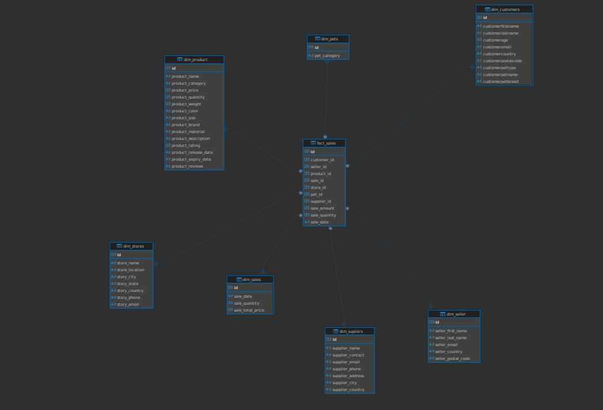

Схема снежинка:

В результате построения снежинки получилась такая структура таблиц:
 
 dim_customers

| Column               | Type        | Description            |
| -------------------- | ----------- | ---------------------- |
| `id`                 | SERIAL      | Primary key            |
| `customerfirstname`  | VARCHAR(50) | Customer's first name  |
| `customerlastname`   | VARCHAR(50) | Customer's last name   |
| `customerage`        | INT         | Customer's age         |
| `customeremail`      | VARCHAR(50) | Customer's email       |
| `customercountry`    | VARCHAR(50) | Country of residence   |
| `customerpostalcode` | VARCHAR(50) | Postal code            |
| `customerpettype`    | VARCHAR(50) | Type of customer's pet |
| `customerpetname`    | VARCHAR(50) | Pet's name             |
| `customerpetbreed`   | VARCHAR(50) | Pet's breed            |

dim_seller

| Column               | Type        | Description         |
| -------------------- | ----------- | ------------------- |
| `id`                 | SERIAL      | Primary key         |
| `seller_first_name`  | VARCHAR(50) | Seller's first name |
| `seller_last_name`   | VARCHAR(50) | Seller's last name  |
| `seller_email`       | VARCHAR(50) | Seller's email      |
| `seller_country`     | VARCHAR(50) | Country             |
| `seller_postal_code` | VARCHAR(50) | Postal code         |

dim_product

| Column                 | Type          | Description                     |
| ---------------------- | ------------- | ------------------------------- |
| `id`                   | SERIAL        | Primary key                     |
| `product_name`         | VARCHAR(50)   | Product name                    |
| `product_category`     | VARCHAR(50)   | Product category                |
| `product_price`        | FLOAT         | Price                           |
| `product_quantity`     | INT           | Available quantity              |
| `product_weight`       | FLOAT         | Weight in kg                    |
| `product_color`        | VARCHAR(50)   | Product color                   |
| `product_size`         | VARCHAR(50)   | Size (e.g. S, M, L)             |
| `product_brand`        | VARCHAR(50)   | Brand name                      |
| `product_material`     | VARCHAR(50)   | Material (e.g. cotton, plastic) |
| `product_description`  | VARCHAR(1024) | Description                     |
| `product_rating`       | FLOAT         | Rating (1–5)                    |
| `product_release_date` | VARCHAR(50)   | Release date                    |
| `product_expiry_date`  | VARCHAR(50)   | Expiry date (if applicable)     |
| `product_reviews`      | VARCHAR(1024) | Customer reviews                |

dim_sales

| Column             | Type        | Description       |
| ------------------ | ----------- | ----------------- |
| `id`               | SERIAL      | Primary key       |
| `sale_date`        | VARCHAR(50) | Date of sale      |
| `sale_quantity`    | INT         | Quantity sold     |
| `sale_total_price` | FLOAT       | Total sale amount |

dim_stores

| Column           | Type        | Description            |
| ---------------- | ----------- | ---------------------- |
| `id`             | SERIAL      | Primary key            |
| `store_name`     | VARCHAR(50) | Store name             |
| `store_location` | VARCHAR(50) | Specific location info |
| `story_city`     | VARCHAR(50) | City                   |
| `story_state`    | VARCHAR(50) | State/region           |
| `story_country`  | VARCHAR(50) | Country                |
| `story_phone`    | VARCHAR(50) | Phone number           |
| `story_email`    | VARCHAR(50) | Email address          |

dim_pets

| Column         | Type        | Description                 |
| -------------- | ----------- | --------------------------- |
| `id`           | SERIAL      | Primary key                 |
| `pet_category` | VARCHAR(50) | Type of pet (e.g. dog, cat) |

dim_supliers

| Column             | Type        | Description    |
| ------------------ | ----------- | -------------- |
| `id`               | SERIAL      | Primary key    |
| `supplier_name`    | VARCHAR(50) | Supplier name  |
| `supplier_contact` | VARCHAR(50) | Contact person |
| `supplier_email`   | VARCHAR(50) | Email address  |
| `supplier_phone`   | VARCHAR(50) | Phone number   |
| `supplier_address` | VARCHAR(50) | Street address |
| `supplier_city`    | VARCHAR(50) | City           |
| `supplier_country` | VARCHAR(50) | Country        |

fact_sales

| Column          | Type        | Description                                    |
| --------------- | ----------- | ---------------------------------------------- |
| `id`            | SERIAL      | Primary key                                    |
| `customer_id`   | INT         | FK → `dim_customers(id)`                       |
| `seller_id`     | INT         | FK → `dim_seller(id)`                          |
| `product_id`    | INT         | FK → `dim_product(id)`                         |
| `sale_id`       | INT         | FK → `dim_sales(id)`                           |
| `store_id`      | INT         | FK → `dim_stores(id)`                          |
| `pet_id`        | INT         | FK → `dim_pets(id)`                            |
| `supplier_id`   | INT         | FK → `dim_supliers(id)`                        |
| `sale_amount`   | FLOAT       | Total price for the sale                       |
| `sale_quantity` | INT         | Number of products sold                        |
| `sale_date`     | VARCHAR(50) | Date of transaction (duplicated for filtering) |

